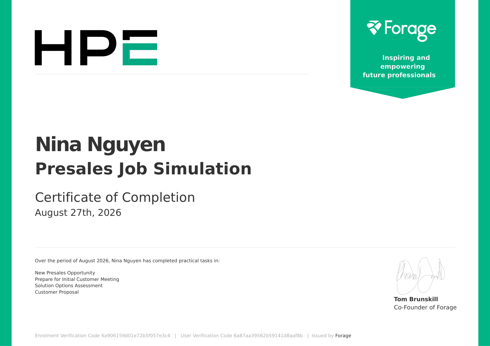

# HPE Presales Job Simulation


## 📌 Overview

This repository documents my experience completing the
**Hewlett Packard Enterprise (HPE) Presales Job Simulation**
through Forage in August 2026.

The simulation involved working through a fictional enterprise
presales engagement for **ABC Financial Services**.

The project covered the presales lifecycle from customer discovery
and requirements analysis to solution evaluation and the development
of an initial infrastructure proposal.

> To respect the confidentiality markings on the simulation materials,
> original HPE/Forage worksheets and presentation files are not
> published in this repository.

---

## 🎯 Business Challenge

ABC Financial Services was planning an infrastructure refresh and
needed to evaluate potential solutions capable of supporting its
current environment while providing flexibility for future growth.

The engagement required balancing several considerations:

- Existing VMware workloads
- Bare-metal workload requirements
- Compute and memory capacity
- Storage growth
- Infrastructure performance
- High availability
- Data-center footprint
- Hybrid-cloud strategy
- Infrastructure scalability
- Consumption-based IT

The goal was not simply to select a product, but to understand the
customer's requirements and identify an appropriate solution direction.

---

# 🔎 Task 1 — Customer Discovery & Requirements Analysis

The first stage focused on understanding the customer's existing
environment, constraints, priorities, and future requirements.

I developed a structured set of discovery questions across several
technical areas.

## Discovery Areas

### VMware

Questions explored:

- Number of virtual machines in scope
- VMware clustering
- Current VMware products and versions
- Planned VMware upgrades

### Compute

Discovery covered:

- Peak processing requirements
- Memory utilization
- CPU preferences
- Capacity headroom
- Future workload growth

### Workloads

I investigated whether the environment contained workloads that could
not be fully virtualized, particularly applications requiring
bare-metal deployment.

This became an important consideration later when comparing
infrastructure options.

### Storage

Key areas included:

- Current storage requirements
- Expected capacity growth
- Flash/NVMe requirements
- Backup and recovery
- Hyperconverged infrastructure preferences

### Data Center

I also considered:

- Rack-space requirements
- Power consumption
- Data-center footprint
- Potential colocation costs

### Future Requirements

The discovery process also considered whether the architecture should
retain flexibility for future technologies such as GPU-enabled
workloads.

---

## 💡 What I Learned from Discovery

The exercise reinforced an important presales principle:

> A solution should not be selected before understanding the
> customer's workloads, constraints, growth expectations and
> operational priorities.

The discovery stage helped convert general customer needs into
requirements that could later be used to evaluate competing
infrastructure approaches.

---

# ⚖️ Task 3 — Solution Options Assessment

After understanding the customer requirements, I evaluated four
potential solution directions.

## Options Considered

### 1. HPE GreenLake + SimpliVity

A traditional hyperconverged infrastructure approach providing
integrated compute and storage.

**Strengths considered:**

- Compact HCI architecture
- VMware-oriented management
- Simplified operations
- Integrated data efficiency and recovery
- GreenLake consumption model

**Trade-offs considered:**

- Compute and storage scale together
- Less flexibility when storage grows faster than compute
- Bare-metal workloads require additional consideration

---

### 2. HPE GreenLake + dHCI

A disaggregated hyperconverged architecture where compute and storage
can scale independently.

**Strengths considered:**

- Independent compute and storage scaling
- Strong VMware integration
- Flexible capacity expansion
- High-performance storage
- GreenLake consumption flexibility

**Trade-offs considered:**

- More components than traditional HCI
- Requires more detailed infrastructure sizing
- Architecture can be more complex than an all-in-one HCI appliance

This option became the preferred direction for the initial proposal.

---

### 3. General Purpose Virtual Machines with HPE GreenLake

A GreenLake infrastructure consumption model designed around the
customer's required service levels.

**Strengths considered:**

- Cloud-like infrastructure consumption
- Supports hybrid-cloud strategy
- Flexible capacity planning
- Reduced infrastructure lifecycle burden

**Trade-offs considered:**

- Less directly differentiated as an HCI solution
- Economics depend on accurate capacity forecasts
- Service boundaries need to be clearly defined

---

### 4. Nutanix on HPE ProLiant DX

A Nutanix-based HCI approach running on HPE infrastructure.

**Strengths considered:**

- Integrated HCI architecture
- Simplified deployment and lifecycle management
- Hybrid multicloud capabilities
- HPE infrastructure foundation

**Trade-offs considered:**

- Potential platform and licensing considerations
- Migration implications
- Coupled compute/storage scaling
- Additional TCO evaluation required

---

## 🧠 Options Analysis Approach

Rather than evaluating solutions only on individual product features,
I compared them against the customer's actual requirements.

The assessment considered:

| Evaluation Area | Key Question |
|---|---|
| Workload Fit | Can the solution support the required workloads? |
| VMware | How well does it integrate with the existing environment? |
| Bare Metal | Can non-virtualized workloads be accommodated? |
| Compute Growth | Can compute capacity scale efficiently? |
| Storage Growth | Can storage expand without unnecessary compute? |
| Performance | Can the architecture address workload bottlenecks? |
| Availability | Does it provide sufficient resilience? |
| Operations | How complex is ongoing management? |
| Hybrid Cloud | Does it support the customer's future strategy? |
| Commercial Model | Can it align with consumption-based infrastructure? |

---

# 🏗️ Task 4 — Initial Solution Proposal

Based on the discovery process and options assessment, I developed an
initial customer proposal around an:

## HPE GreenLake + dHCI Solution

The proposed architecture combined:

**HPE ProLiant Compute**

with

**HPE Alletra Storage**

and

**HPE GreenLake**

for a consumption-based infrastructure model.

---

## Why dHCI?

One of the key insights from the assessment was that compute and
storage requirements may not grow at the same rate.

Traditional HCI architectures typically scale compute and storage
together.

dHCI provides greater flexibility:

```text
Traditional HCI

Compute + Storage
       ↓
Scale Together


dHCI

Compute  ───────→ Scale Independently

Storage  ───────→ Scale Independently
```

This made dHCI an attractive direction where storage growth could
outpace compute growth.

---

## 🏛️ Conceptual Architecture

The proposal followed this general architecture:

```text
                 HPE GreenLake
                       │
              Consumption Model
                       │
                       ▼
               VMware vCenter
                       │
              Integrated Management
                       │
          ┌────────────┴────────────┐
          │                         │
          ▼                         ▼

     HPE ProLiant                HPE Alletra
        Compute                    Storage

          │                         │
          └────────────┬────────────┘
                       │
                       ▼

              Enterprise Workloads
```

The architecture was designed around several principles:

- VMware integration
- Independent scaling
- High availability
- Storage performance
- Infrastructure visibility
- Future growth
- Hybrid-cloud readiness

---

# 🔄 Presales Workflow

The complete simulation followed a structured presales process:

```text
Customer Opportunity
        ↓
Customer Discovery
        ↓
Requirements Analysis
        ↓
Infrastructure Assessment
        ↓
Solution Research
        ↓
Options Analysis
        ↓
Solution Selection
        ↓
Initial Architecture
        ↓
Customer Proposal
        ↓
Customer Feedback
        ↓
Solution Refinement
```

This helped demonstrate how presales connects business requirements
with technical solution design.

---

# 📊 Key Skills Demonstrated

## Customer & Business Analysis

- Customer Discovery
- Requirements Analysis
- Business Needs Analysis
- Probing Questions
- Stakeholder Communication

## Presales

- Presales Process
- Solution Selling
- Options Analysis
- Proposal Development
- Customer Presentation

## Analytical Skills

- Critical Thinking
- Comparative Analysis
- Trade-off Analysis
- Requirements-to-Solution Mapping
- Solution Evaluation

## Technical Concepts

- VMware Infrastructure
- Hyperconverged Infrastructure (HCI)
- Disaggregated HCI (dHCI)
- Enterprise Compute
- Enterprise Storage
- Hybrid Cloud
- HPE GreenLake
- Infrastructure Scalability

---

# 💭 Key Takeaways

The most valuable lesson from this simulation was that presales is
not simply about recommending a product.

The process starts with understanding the customer.

```text
Customer Problem
       ↓
Discovery
       ↓
Requirements
       ↓
Options
       ↓
Trade-offs
       ↓
Solution
       ↓
Business Value
```

A technically capable solution may still be the wrong recommendation
if it does not align with workload requirements, growth patterns,
operational preferences or business priorities.

The simulation also reinforced the importance of asking the right
questions before moving into solution design.

---

# 🏆 Certificate

I completed the **Hewlett Packard Enterprise Presales Job Simulation**
through Forage in **August 2026**.

The simulation included practical tasks covering:

- New Presales Opportunity
- Initial Customer Meeting Preparation
- Solution Options Assessment
- Customer Proposal



---

# 📁 Repository Structure

```text
hpe-presales-job-simulation/
│
├── README.md
│
└── HPE_Presales_Job_Simulation_Certificate.png
```

The original simulation worksheets and customer proposal are not
published because some of the provided materials are marked as
confidential or intended for authorized use.

This README instead documents my personal analysis, approach and
learning outcomes from the simulation.

---

# 🔗 Skills

`Presales`
`Solution Sales`
`Business Analysis`
`Requirements Analysis`
`Customer Discovery`
`Options Analysis`
`Critical Thinking`
`HPE GreenLake`
`HCI`
`dHCI`
`VMware`
`Infrastructure`
`Solution Architecture`

---

## Disclaimer

This repository documents my personal learning experience from the
**Hewlett Packard Enterprise Presales Job Simulation on Forage**.

The simulation represents a fictional customer scenario and does not
represent employment or professional engagement with Hewlett Packard
Enterprise.

HPE, HPE GreenLake, HPE Alletra, HPE ProLiant and other referenced
product names are trademarks of their respective owners.
